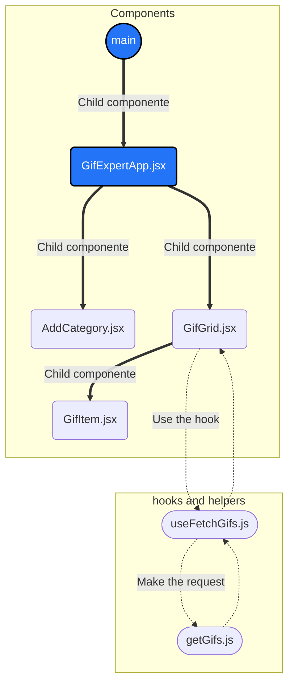

# Gif Expert App
Es una aplicación hecha con React y con Vite. Permite realizar una búsqueda de Gifs, esto utilizando la API de Giphy.

En el siguiente diagrama se muestran los componentes que se utilizan en la aplicación así como el hook que se creo y el helper.

## Scripts
En el directorio del proyecto, puede ejecutar:
### `yarn dev`
Ejecuta la aplicación en el modo de desarrollo.
Abra [http://localhost:5773](http://127.0.0.1:5173) para verlo en su navegador.

La página se volverá a cargar cuando realice cambios.

También puede utilizar `yarn dev --host` para exponer

### `yarn build` 
Construye la aplicación para producción en la carpeta `dist`.
Empaqueta correctamente React en modo de producción y optimiza la compilación para obtener el mejor rendimiento.

La compilación se minimiza y los nombres de archivo incluyen los hashes.
¡Tu aplicación está lista para ser implementada!

Consulte la sección sobre [deployment](https://facebook.github.io/create-react-app/docs/deployment) para obtener más información.

## Component main
En el componente main se importa los estilos así como también el componente hijo ``GifExpertApp``.
Dentro de este componente se obtiene el id del elemento div y se utiliza para que se pueda renderizar la aplicación.

## Componente GifExpertApp
Dentro de este componente se importa el `useState` así como los componentes ``AddCategory`` y `GifGrid`.

Se usa el ``useState`` y se desestructura categories que corresponde al estado inicial y setCategories que corresponde como nuevo estado, "categories" contiene un arreglo que por el momento tiene OnePuch como valor inicial.

### Función onAddCategory
Esta función recibe como parámetro newCategory y se tiene que evaluar si el valor de newCategory existe en el arreglo de categories, esto se hace un `if` y a través del método `includes`, si el valor ya existe dentro del arreglo se hace un `return` y se sale de la función. 
Si el valor no existe se utiliza setCategories (nuevo estado), dentro del arreglo se agrega/inserta lo que se recibe de newCategory y luego se hace la desestructuración de categories donde categories son las categorias anteriores (o del estado actual). Al final de esta manera se van agregando al arreglo los elementos de las nuevas búsquedas que se vayan realizando.

*Esta función se manda como una props al componente `AddCategory` y lo que se retorne de allá se recibe como newCategory.*

### return
Dentro del return se tiene un fragmento, luego un titulo el cual es GifExpertApp. 
Luego se utiliza el componente `AddCategory` y se le manda la props `onNewCategory` el cual contiene la función `onAddCategory`.

Para el listado de items se utiliza el método ``map``, `map` permite mostrar los elementos del arreglo ya que barre cada uno de los elementos del arreglo y regresa un nuevo arreglo. 
Luego se utiliza el componente `GifGrid`, en el key se pone el category, de momento no hay ningún problema ya que desde la función `onAddCategory` no se esta dejando agregar elementos repetidos por lo cual el key es único. Y también se envia como una props category y su valor es lo que nos arroja este nuevo arreglo. Dentro del componente `GifGrid` se desestructura.

## Componente AddCategory
Este componente es básicamente un form el cual contiene un input que se observa en la web. Primeramente se importa el ``useState``, como estado inicial se declara inputValue y contiene un string vacío y como nuevo estado se tiene setInputValue.

### Función onInputChange
Esta función permite detectar el cambio del input, es decir, permite mostrar lo que se escribe o se borra dentro del input. 
Utiliza el event y se accede al target y al value, después ese nuevo valor del input o los nuevos cambios se guardan en el setInputValue, el cual se convierte en el nuevo estado. También al momento que se detecta este cambio se envía al input permitiendo mostrar lo que se vaya escribiendo.

### Función onSubmit
Esta función se activa al momento de envíar la búsqueda del Gif que se desea.
Se utiliza event junto con el método `preventDefault` para evitar que la página se recargue cada que se envíe o se realice la búsqueda.

Luego se tiene una validación, se utiliza la condicioón `if` y el método `trim` el cual permite eliminar o limpiar los espacios de adelante y atrás. Después, si el valor del inputValue tiene un tamaño menor a un carácter se hace un return lo que indica que se salga de la función y ya no se realiza lo demás.

Si la condición anterios es false, es decir, que el inputValue contiene más de un caracter se utiliza la props que se envía del componente padre que es `onNewCategory` el cuál contiene la función `onAddCategory`(está función es la que permite agregar un nuevo elemento al arreglo). Entonces, se utiliza `onNewCategory` y se le envía como parámetro el valor del inputValue.

Luego se utiliza el `setInputValue` y se le manda como nuevo estado un string vacío que permite limpiar el input después que se guarda o se realiza la búsqueda.

### return
Dentro del `return` se tiene la etiqueta form, se utiliza el atribute ``onSubmit`` y se llama a la función ``onSubmitInput``.

También se utiliza una etiqueta input, en el value se le pasa el inputValue el cual es el estado inicial. Luego se utiliza el atribute ``onChange`` para llamar a la función ``onInputChange`` y se envía el evento. Entonces, cada que se escriba o se borre algo del input se detecta el cambio del value y se manda a la función ``onInputChange`` y se guarda en el nuevo estado setInputValue.

## Componente GifGrid
Se importa el componente `GridItem` así como el hook `useFetchGifs`.

El componente `GifGrid` recibe la props category, luego se utiliza el hook `useFetchGifs` y se manda como parámetro la props category, de este hook se desestructura images e isLoading ya que se retorna de este hook.

En el h3 Se utiliza la props category, el cuál muestra el nombre del gif que se buscó.

Se hace una condición, si isLoading está en true va a ejecutar la segunda parte de esta instrucción y si está en false ya no va a continuar las demás evaluaciones. Lo que se muestra es una condición lógica. En general, el mensaje de cargando se va a mostrar si se tarda en hacer la petición.

En el div se pone la clase card-grid.

Se utiliza JavaScript para utilizar el método ``map``, del método se extrae el id y se pone en el key y se envía como props image, el cual contiene id, title y la url de la imagen.
La props image se puede enviar de varias maneras, ya sea desestructurar directamente del ``map`` (id, title, url) y de la misma manera se enviarían. También puede ser con spreed {…image} y entonces en el componente hijo se hace la desestructuración.

## Componente GifItem
De forma general en este componente se muestran los gifs, la imagen así como su title.

Recibe la props image y se accede a image.url e image.title.

## Hook useFetchGifs
Este es un hook que se ha creado desde cero, dentro se utiliza la función getGifs, por lo cuál se importa. 

Dentro se declaran dos estados, images (estado inicial) y setImages (el nuevo estado). El estado inicial comienza con un arreglo vacío.

El otro estado es para cargar las imágenes, el estado inicial es isLoading y se define por primera vez como true y el nuevo estado es setIsLoading. 

Se recibe la props category, esta props contiene la búsqueda de los gifs.

### Función getImages
Luego se declara la función ``getImages`` que es una función asíncrona, es decir, que se va a esperar a que se termine de ejecutar algo, que en este caso espera a que la función ``getGifs`` se termine de ejecutar por eso también se le agrega await ya que es una promesa. Y también se le pasa como parámetro category para buscar los gifs. Todo lo anterior se le asigna a la constante newImages.

Una vez que se obtiene la petición se guardan las nuevas imagenes en el nuevo estado setImages.

Cuando ya se obtienen las imágenes el nuevo estado de setIsLoading se pone en false.

### Hook useEffect
Luego se utiliza el useEffect (no puede ser asíncrono), el primer argumento que recibe es el código que se quiere ejecutar que en este caso es la función ``getImages``.
El segundo argumento es un arreglo de las dependencias. Si se deja vacío significa que este hook solo se va a disparar la primera vez que se crea y se construye el componente.
 
Luego se hace un return de un objeto, que sería images y isLoading.

*Este hook se utiliza en el componente GifGrid*.

## Helper getGifs
Aquí se encuentra la función para hacer la petición a la API. Es una función asíncrona, recibe como parámetro category, luego se declara una constante url y se le asigna la url como tal de la API y se le añade category, ya que contiene la palabra a buscar y dentro también se especifica que solo debe traer 10 resultados.

Luego se llama a la API con fetch y como es una promesa se le pone await. 

Después, se desestructura la data (la data es un arreglo) y como también es una promesa se le pone await y devuelve un json.

Como la data es un arreglo se puede usar el método ``map`` para extraer los elementos que se van a ocupar, que en este caso es el id, title y la url de la imagen.

Por último, se hace un return de gifs para que se pueda utilizar en el archivo `useFetchGifs`.